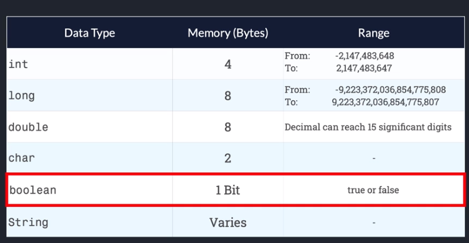

# Java
# **_Java Tutorial for Beginners_**

Data types are used to define the type of value that the variable will be allowed to store. Data types are divided into two groups:

**Primitive data types** - byte, short, int, long, float, double, boolean and char

**Non-primitive data types** - such as String, Arrays and Classes.